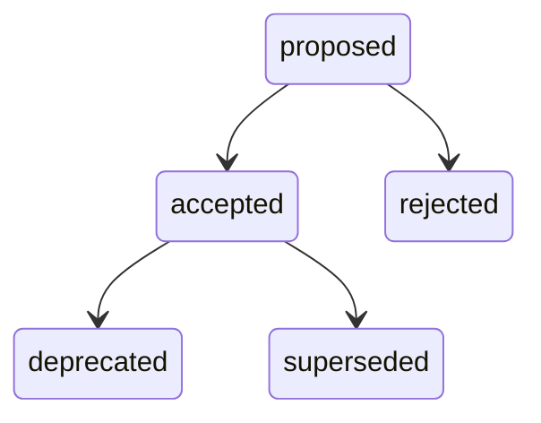

# Create Diagram

Create effective D2 or Mermaid diagrams optimized for terminal display.

## When to Use

- Architecture or infrastructure diagrams
- System interaction flows (request paths, failure cascades)
- Process flowcharts or state machines
- Incident failure diagrams showing what went wrong

## Workflow

1. **Identify components**: Ask what nodes (services, databases, users) and edges (connections, data flows) to show
2. **Draft the D2/Mermaid code**: Write a first version following the terminal best practices below
3. **Review for readability**: Check label lengths, node count, layout direction
4. **Place in document**: Add as a fenced code block in the appropriate section

## Terminal Best Practices

Diagrams render as ASCII art in the terminal. Follow these rules for clean output.

### Keep it small

Aim for **5-7 nodes** max. Terminals are typically 80-120 columns wide. More nodes = unreadable overlaps.

If you need more, use **containers** to group related nodes:

```d2
vpc: VPC {
  api: API
  db: Database {shape: cylinder}
  api -> db
}
client: Client
client -> vpc.api
```

### Use short labels

Edge labels over ~15 characters get moved to a legend at the bottom, disconnecting them from context.

- Bad: `api -> db: "sends authenticated read requests for user data"`
- Good: `api -> db: reads`

Node labels should also be concise. Use the key as short ID and label for display:

```d2
pg: PostgreSQL {shape: cylinder}
```

### Set direction

Default is top-to-bottom. For terminal, `direction: right` often works better as it uses horizontal space:

```d2
direction: right
a: Service A
b: Service B
a -> b: calls
```

### Use shapes for meaning

Supported shapes that render distinctly:

- `shape: cylinder` — databases, connection pools, queues
- `shape: diamond` — decision points
- `shape: hexagon` — APIs or key services
- `shape: circle` — users, external actors
- Default rectangle — everything else

### Cycles are warned

A cycle like `A -> B -> C -> A` triggers a D002 warning. This is informational — cycles in incident/failure diagrams are often intentional. To avoid warnings on return paths, restructure as:

```d2
# Instead of A -> B and B -> A, use:
a <-> b: request/response
```

### Mermaid vs D2

Both work. D2 is simpler for architecture diagrams. Mermaid is better for state machines and sequence diagrams.



## Common Patterns

### Incident failure diagram

```d2
users: Users {shape: circle}
api: API
db: Database {shape: cylinder}

users -> api: requests
api -> db: queries
api -> users: 503 errors
```

### Architecture overview

```d2
direction: right
client: Browser
api: API {shape: hexagon}
db: PostgreSQL {shape: cylinder}
cache: Redis {shape: cylinder}

client -> api: HTTPS
api -> db: reads/writes
api -> cache: cached reads
```

### Decision flow

```d2
direction: right
start: Request
auth: Authenticated? {shape: diamond}
allow: Allow
deny: Deny

start -> auth
auth -> allow: yes
auth -> deny: no
```

## Tips

- Always test rendering width: `dg show DOC-ID` shows actual terminal output
- If labels overflow to legend, shorten them — inline labels are always more readable
- Use comments (`# ...` in D2) to document intent without affecting rendering
- Prefer D2 for static architecture, Mermaid `stateDiagram-v2` for lifecycles
