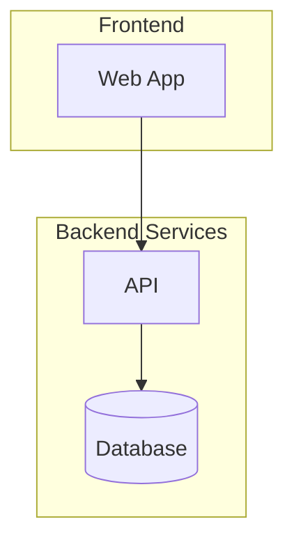
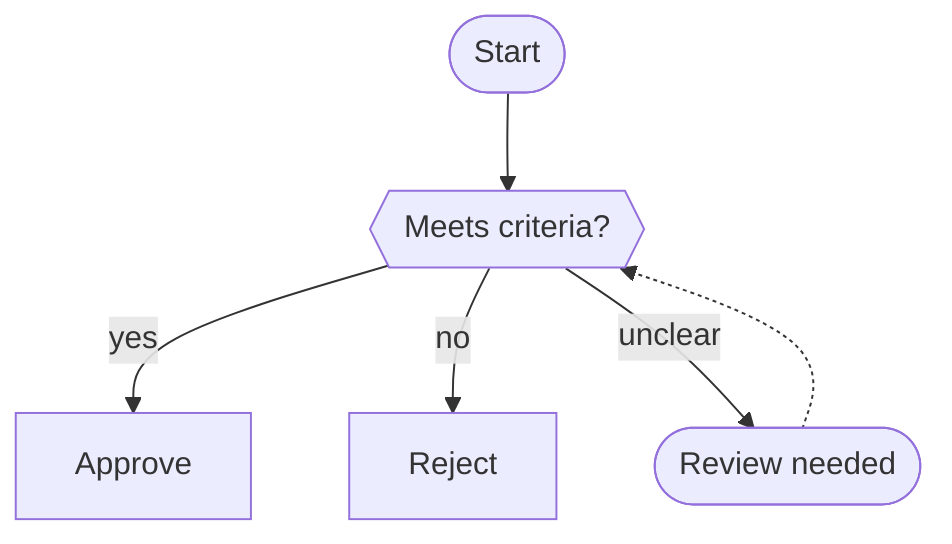
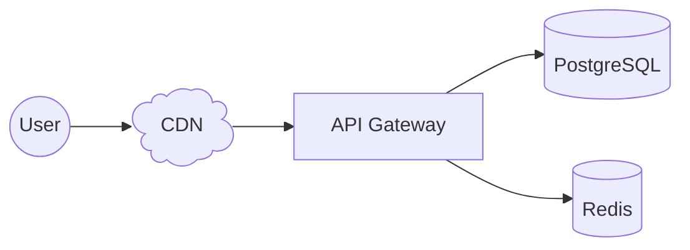
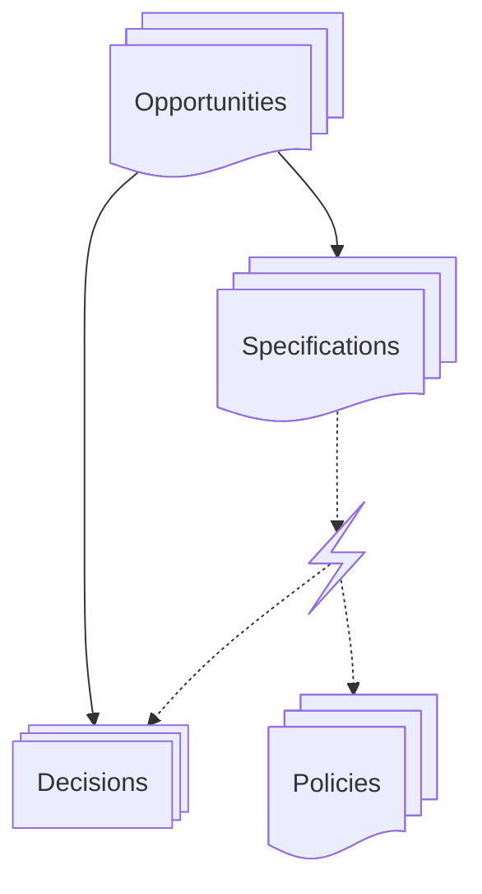

# Mermaid Flowchart

Complete reference for building Mermaid flowchart diagrams in DecisionGraph documents.

## When to Use

- Process flows, decision trees, system interactions
- Document relationship diagrams (how OPPs, ADRs, SPECs connect)
- Onboarding flows, deployment pipelines, data flows
- Any directed graph that fits in a `mermaid` code block

## Direction

```
flowchart TD   %% Top-down (default)
flowchart LR   %% Left-right (better for wide diagrams)
flowchart BT   %% Bottom-top
flowchart RL   %% Right-left
```

## Node Shapes

### Basic (all Mermaid versions)

```
A["Rectangle"]
B("Rounded")
C(["Stadium / pill"])
D[["Subroutine"]]
E[(Cylinder / database)]
F((Circle))
G>Asymmetric / flag]
H{Diamond / decision}
I{{Hexagon}}
J[/Parallelogram/]
K[\Parallelogram alt\]
L[/Trapezoid\]
M[\Trapezoid alt/]
N(((Double circle)))
```

### Semantic shapes (Mermaid v11.3+)

Use `@{ shape: name, label: "text" }` for richer shapes:

```
%% Stacked shapes — visually show "many of this"
A@{ shape: docs, label: "Multiple documents" }
B@{ shape: processes, label: "Multiple processes" }

%% Special shapes
C@{ shape: cloud, label: "Cloud service" }
D@{ shape: bolt, label: "Event / trigger" }
E@{ shape: flag, label: "Milestone" }
F@{ shape: brace, label: "Annotation" }
G@{ shape: text, label: "Floating text" }

%% All semantic names:
%% rect, rounded, stadium, pill, circle, diam, hex, lean-r, lean-l,
%% trap-b, trap-t, dbl-circ, fr-rect, cyl, docs, doc, processes,
%% notch-rect, tag-rect, brace, brace-r, cloud, bolt, flag,
%% hourglass, tri, win-pane, text, lin-rect, lin-cyl, curv-trap,
%% div-rect, odd, cross, comment
```

### Shape selection guide

| Shape       | Use for                                | Syntax                                 |
| ----------- | -------------------------------------- | -------------------------------------- |
| `docs`      | Collection of documents (OPPs, POLs)   | `@{ shape: docs }`                     |
| `processes` | Multiple processes or decisions (ADRs) | `@{ shape: processes }`                |
| `cyl`       | Databases, queues, storage             | `[(text)]` or `@{ shape: cyl }`        |
| `diam`      | Decision points, conditionals          | `{text}` or `@{ shape: diam }`         |
| `circle`    | Actors, users, external systems        | `((text))` or `@{ shape: circle }`     |
| `dbl-circ`  | Organizations, top-level entities      | `(((text)))` or `@{ shape: dbl-circ }` |
| `cloud`     | External services, SaaS                | `@{ shape: cloud }`                    |
| `flag`      | Milestones, goals                      | `@{ shape: flag }`                     |
| `bolt`      | Events, triggers, incidents            | `@{ shape: bolt }`                     |
| `stadium`   | Key processes, starting points         | `([text])` or `@{ shape: stadium }`    |

## Links / Edges

### Arrow types

```
A --> B          %% Solid arrow
A --- B          %% Solid line (no arrow)
A -.-> B         %% Dotted arrow
A -.- B          %% Dotted line
A ==> B          %% Thick arrow
A === B          %% Thick line
A ~~~ B          %% Invisible link (layout only)
A <--> B         %% Bidirectional
A --o B          %% Circle end
A --x B          %% Cross end
```

### Text on edges

```
A -->|"label text"| B       %% Pipe syntax (preferred)
A -- "label text" --> B     %% Inline syntax
A -. "dotted label" .-> B   %% Dotted with text
A == "thick label" ==> B    %% Thick with text
```

### Link length

Add extra dashes/dots/equals to increase length:

```
A --> B            %% Normal
A ----> B          %% Longer
A ------> B        %% Even longer
A -.....-> B       %% Long dotted
A ====> B          %% Long thick
```

## Subgraphs



Subgraphs can have their own direction and can be nested.

## Styling

### Class definitions

```
classDef primary fill:#4f46e5,stroke:#3730a3,color:#fff;
classDef danger fill:#dc2626,stroke:#991b1b,color:#fff;
classDef muted fill:#f3f4f6,stroke:#d1d5db,color:#374151;

A:::primary --> B:::danger
C:::muted
```

### Direct node styling

```
style A fill:#f9f,stroke:#333,stroke-width:2px
```

### Link styling (by index)

```
linkStyle 0 stroke:#ff3,stroke-width:4px
linkStyle 1,2 stroke:#0f0
```

## Interactions

```
click A "https://example.com" "Opens docs" _blank
click B callback "Tooltip text"
```

## Text & Special Characters

- Use double quotes for special chars: `A["Node with (parens)"]`
- Line breaks: `<br/>` inside quoted labels
- HTML entities: `#amp;` `#lt;` `#gt;` `#quot;`
- Unicode works in quoted strings: `A["Caf&eacute;"]`
- Comments: `%% This is a comment`
- Markdown in labels: `A["**bold** and *italic*"]`

## Best Practices for DecisionGraph

1. **5-8 nodes max** — more gets unreadable, use subgraphs to group
2. **Short edge labels** — max ~15 chars, use `<br/>` for 2-line labels
3. **LR for wide flows**, **TD for hierarchies**
4. **Use semantic shapes** to convey meaning at a glance (docs for document collections, bolt for events)
5. **Dashed edges for feedback loops** — solid for primary flow, `-.->` for secondary/feedback
6. **Double-circle for actors** — organizations, users, external systems

## Common Patterns

### Decision flow



### System architecture



### Document relationship graph


