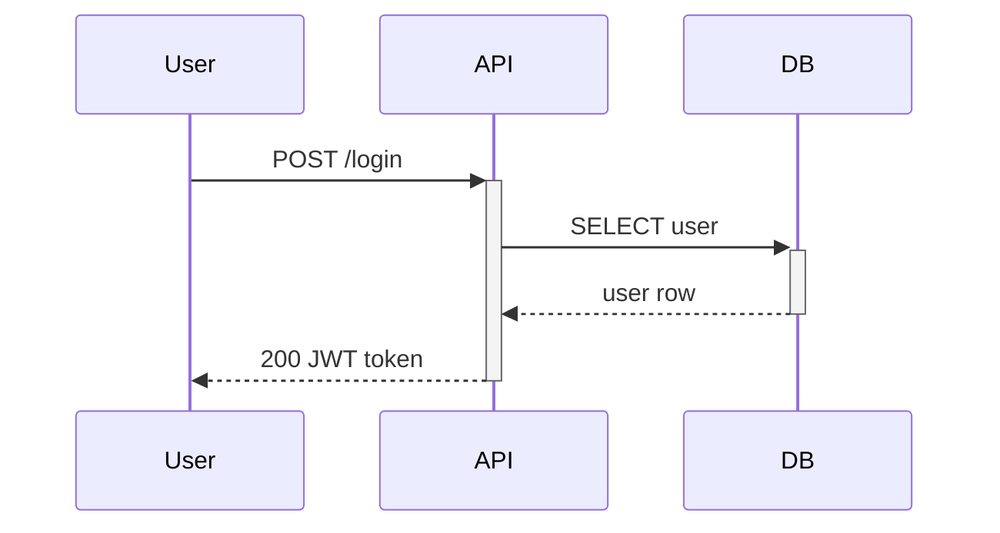

# Mermaid Sequence Diagram

Complete reference for building Mermaid sequence diagrams in DecisionGraph documents.

## When to Use

- API call flows between services
- User interaction sequences (login, checkout, onboarding)
- Incident timelines showing failure cascades
- Integration flows with external systems
- Any time-ordered interaction between participants

## Participants

### Types

```
participant API           %% Rectangle box
actor User                %% Stick figure
participant DB as Database  %% Alias
actor Admin as "Admin User" %% Actor with alias
```

### Stereotypes (typed participants)

```
participant DB, {"type": "database"}
participant Q, {"type": "queue"}
participant Cache, {"type": "collections"}
participant Auth, {"type": "boundary"}
participant Logic, {"type": "control"}
participant User, {"type": "entity"}
```

### Grouping in boxes

```
box "Backend" rgb(230, 240, 255)
    participant API
    participant DB
end

box "External"
    participant Stripe
    participant SendGrid
end
```

## Messages / Arrows

### Arrow types

```
A -> B: Solid line, no arrow
A --> B: Dotted line, no arrow
A ->> B: Solid with arrowhead (most common)
A -->> B: Dotted with arrowhead (response/async return)
A -x B: Solid with cross (failure/rejection)
A --x B: Dotted with cross
A -) B: Solid open arrow (async fire-and-forget)
A --) B: Dotted open arrow
A <<->> B: Bidirectional solid (v11+)
A <<-->> B: Bidirectional dotted (v11+)
```

### Choosing the right arrow

| Arrow   | Use for                         |
| ------- | ------------------------------- |
| `->>`   | Synchronous request             |
| `-->>`  | Response / return value         |
| `-)`    | Async message (fire-and-forget) |
| `-x`    | Failed request / rejection      |
| `<<->>` | Bidirectional / handshake       |

## Activations

Show when a participant is actively processing:



- `+` after arrow activates the target
- `-` after arrow deactivates the target
- Can stack multiple activations

Explicit form:

```
activate API
deactivate API
```

## Notes

```
Note right of API: Validates JWT
Note left of User: Enters credentials
Note over API: Processing...
Note over API, DB: Shared context
```

Use `<br/>` for line breaks in notes.

## Control Flow

### Loop

```
loop Every 30 seconds
    Monitor ->> API: Health check
    API -->> Monitor: 200 OK
end
```

### Alt / Else (conditionals)

```
alt Success
    API -->> User: 200 OK
else Unauthorized
    API -->> User: 401
else Server Error
    API -->> User: 500
end
```

### Opt (optional)

```
opt User has 2FA enabled
    API ->> User: Enter OTP
    User ->> API: OTP code
end
```

### Par (parallel)

```
par Notify user
    API -) Email: Send confirmation
and Update analytics
    API -) Analytics: Track event
and Invalidate cache
    API -) Cache: Delete key
end
```

### Critical

```
critical Payment processing
    API ->> Stripe: Charge card
    Stripe -->> API: Success
option Card declined
    Stripe -->> API: Declined
    API -->> User: Payment failed
option Timeout
    API -->> User: Try again later
end
```

### Break

```
break Auth token expired
    API -->> User: 401 Unauthorized
end
```

## Background Highlighting

Highlight regions with color:

```
rect rgba(0, 128, 255, 0.1)
    User ->> API: Request
    API -->> User: Response
end
```

## Create & Destroy Participants

```
User ->> API: POST /webhook
create participant Worker
API ->> Worker: Process job
Worker -->> API: Done
destroy Worker
API ->> Worker: Cleanup
```

## Sequence Numbers

```
autonumber
User ->> API: Step 1
API ->> DB: Step 2
DB -->> API: Step 3
```

## Actor Menus (clickable links)

```
link API: Swagger Docs @ https://api.example.com/docs
link API: Source Code @ https://github.com/org/api
links DB: {"Schema": "/docs/schema", "Migrations": "/docs/migrations"}
```

## Comments

```
%% This is a comment
```

## Best Practices for DecisionGraph

1. **4-6 participants max** — more gets unreadable, group with boxes
2. **Name participants by role**, not technology: "Payment Service" not "Stripe API"
3. **Show the happy path first**, then alt/else for error cases
4. **Use activations** to show processing time and call depth
5. **Dotted arrows for responses** — solid for requests, dotted for returns
6. **Notes for context** — explain non-obvious steps without cluttering arrows
7. **Use `autonumber`** for incident timelines so steps can be referenced

## Common Patterns

### API request flow

```mermaid
sequenceDiagram
    actor User
    participant API
    participant DB, {"type": "database"}
    participant Cache, {"type": "collections"}

    User ->>+ API: GET /profile
    API ->> Cache: Lookup
    alt Cache hit
        Cache -->> API: Cached data
    else Cache miss
        API ->>+ DB: SELECT
        DB -->>- API: Row
        API ->> Cache: Store
    end
    API -->>- User: 200 Profile JSON
```

### Incident timeline

```mermaid
sequenceDiagram
    autonumber
    participant LB as Load Balancer
    participant API
    participant DB, {"type": "database"}

    LB ->> API: Route request
    API ->>+ DB: Query
    Note over DB: Connection pool exhausted
    DB --x API: Timeout (30s)
    API -->> LB: 503
    loop Retry storm
        LB ->> API: Retry
        API -x DB: Connection refused
        API -->> LB: 503
    end
```

### Async event flow

```mermaid
sequenceDiagram
    participant API
    participant Q, {"type": "queue"}
    participant Worker
    participant Email

    API -)+ Q: Enqueue job
    Q ->>+ Worker: Dequeue
    Worker ->> Worker: Process
    Worker -)- Email: Send notification
    Worker -->>- Q: Ack
```
